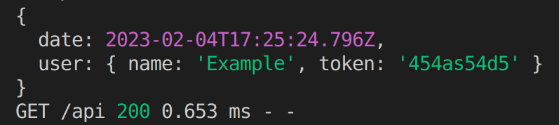

# mini-express-server

A minimal implementation of a web server based in express architecture using only build-in node modules like path, http, and fs. The core class is `AppServer` that create a instance of Server calling createServer from `node:http`

## installation

```sh
npm i mini-express-server --save
```

The implementation mantain the same architecture of express, where you can configure several middleware for every route. Also you can register global middlewares. See the example in typescript

## Usage

```TypeScript
import AppServer, { IRequest, IResponse } from 'mini-express-server';

const app: AppServer = new AppServer();
const morgan = require('morgan');

const port: number = +(process?.env?.PORT || 1234);

///////You can use morgan middleware for logging as express ////////
app.use(morgan('dev'));

app.get('/', (req: IRequest, res: IResponse) => {
  console.log('Hello World');
  return res.status(200).text('Hola mundo');
});

app.get('/api', (req, res) => {
  const { query, params, body, headers } = req;
  res.status(200).json({ query, params, body, headers });
});

app.listen(port, (address: any) => {
  console.log('Server listening on: ', address);
});

```

**You can define multiples middlewares**

```TypeScript
...
/// Declaring middlewares /////////
const midd1: IMiddleware = (req: IRequest, res: IResponse, next) => {
  req.context.date = new Date();
  next();
};
const midd2: IMiddleware = (req: IRequest, res: IResponse, next) => {
  req.context.user = { name: 'Example', token: '454as54d5' };
  next();
};

app.get('/', midd1, (req: IRequest, res: IResponse) => {
  console.log('Hello World');
  return res.status(200).text('Hello World');
});

app.get('/api', midd1, midd2, (req, res) => {
  const { query, params, body, headers, context } = req;
  console.log(context);
  res.status(200).json({ query, params, body, headers, context });
});
....
```

Example response when we hit the endpoint /api


### Error Handling

By default the library catch all the error inside of the middleware and pass them to a internal global error handler where the message of the error is returned back to the client. Also as in express you can passto the next function the object that represent the error.

```TypeScript
import AppServer, { IMiddleware, IRequest, IResponse, ServerError } from 'mini-express-server';

const app: AppServer = new AppServer();
const morgan = require('morgan');
const port: number = +(process?.env?.PORT || 1234);

app.use(morgan('dev'));

app.get(`/error/1`, (req, res, next) => {
  next(new ServerError(400, 'Custom Error', [{ message: 'Custom error to test' }]));
});

app.get(`/error/2`, async (req, res, next) => {
  let asyncOp = new Promise((_, reject) => {
    setTimeout(() => {
      reject('There was an error');
    }, 1000);
  });
  await asyncOp;
});

app.listen(port, (address: any) => {
  console.log('Server listening on: ', address);
});
```

**You can configure your custom Error handler**

```TypeScript
import AppServer, { IMiddleware, IRequest, IResponse, ServerError } from 'mini-express-server';

const app: AppServer = new AppServer();
const morgan = require('morgan');
const port: number = +(process?.env?.PORT || 1234);

app.use(morgan('dev'));

app.get(`/error/1`, (req, res, next) => {
  next(new ServerError(400, 'Custom Error', [{ message: 'Custom error to test' }]));
});

app.get(`/error/2`, async (req, res, next) => {
  let asyncOp = new Promise((_, reject) => {
    setTimeout(() => {
      reject(
        new ServerError(429, 'Too many requeest', [
          'To many request for this user',
          'Clean cookies',
        ])
      );
    }, 1000);
  });
  await asyncOp;
});

///////// Custom Error handler //////////////////////////////
app.setErrorHandler((req, res, error) => {
  console.error('There is an error: ', error.message);
  let code = error.code && !isNaN(parseInt(error.code)) ? error.code : 500;
  res.status(code).json({ message: error.message, error: true, meta: error.meta });
});

app.listen(port, (address: any) => {
  console.log('Server listening on: ', address);
});
```

Example response when we hit the endpoint /error/2


### Static files Server

The mini-express-server also have the capabilities of serving static files and is quite similar with express. Bu here using the method `setStatic`. In the example bellow you can find how to set different endpoint for serving static files

```TypeScript
import AppServer, { IMiddleware, IRequest, IResponse, ServerError } from 'mini-express-server';

const app: AppServer = new AppServer();
const morgan = require('morgan');
import path from 'node:path';

const port: number = +(process?.env?.PORT || 1234);

app.use(morgan('dev'));

...
/// first the endpoint for static files, the other the root path of thte directory that contain the files
app.setStatic('/static', path.join(__dirname, '..', 'public'));
app.setStatic('/storage', path.join(__dirname, '..', 'storage'));
...

app.listen(port, (address: any) => {
  console.log('Server listening on: ', address);
});

```
Here an example of serving static files from diferent sources: [https://stackblitz.com/edit/node-u2qygg?file=index.js](https://stackblitz.com/edit/node-u2qygg?file=index.js)

## Stackblitz example

[https://stackblitz.com/edit/node-mpg9k4?file=index.js](https://stackblitz.com/edit/node-mpg9k4?file=index.js)
